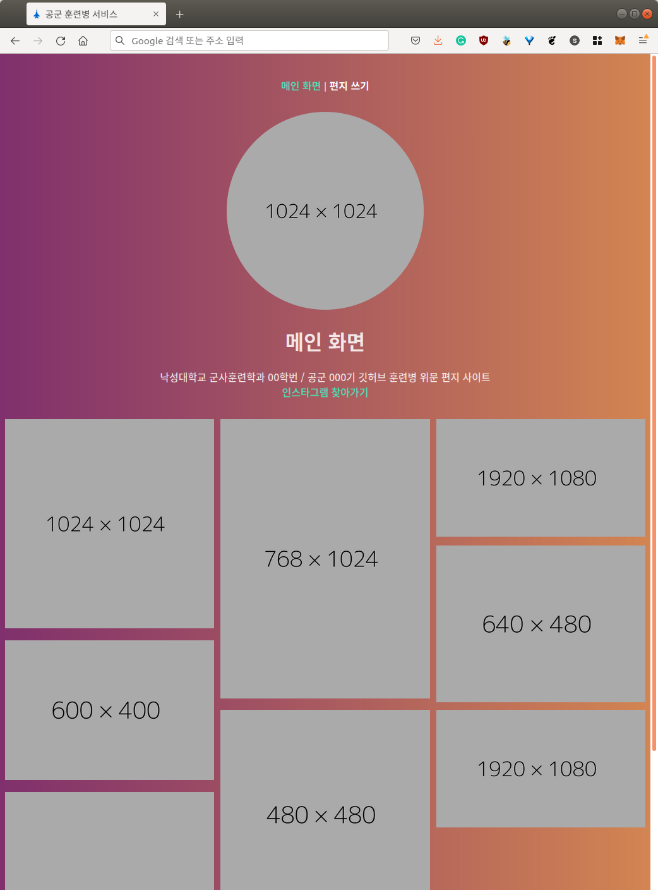
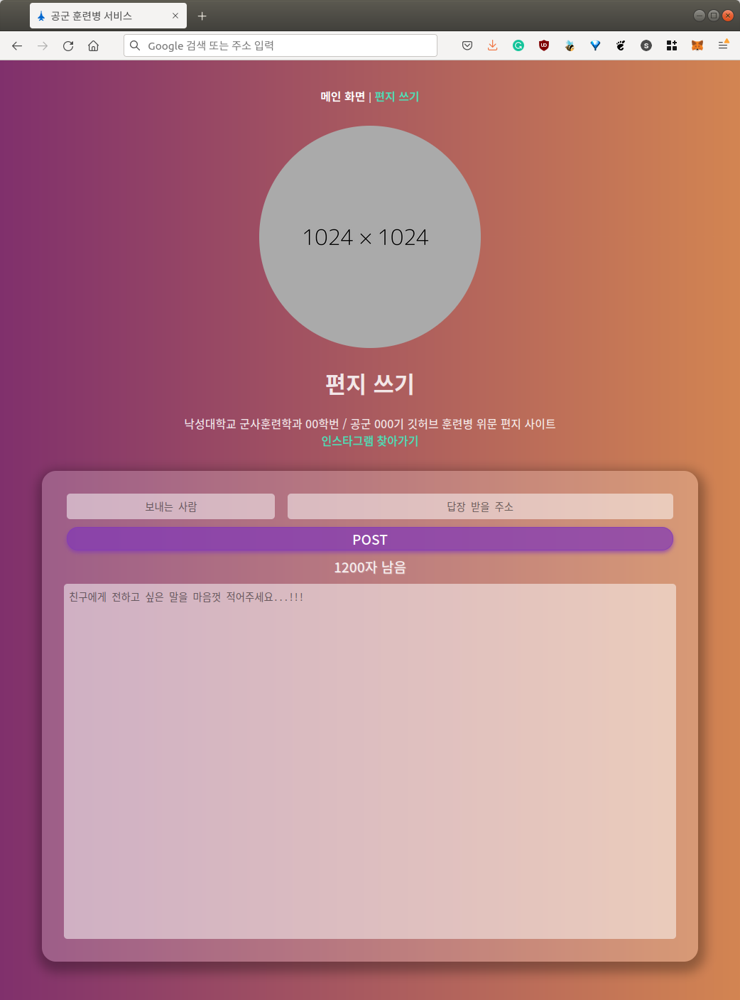

# ROKAF-LETTER

공군에 입대한 친구를 위해, 조금이라도 편지 많이 받아주려고 만들었던 웹 서비스

### 예시
#### 메인 화면

#### 편지 쓰기

### 구성
* Vue.js + Express.js + CouchDB

### 주의사항
* C 개발자가 웹 서비스 만들어보겠다고 2일 동안 혼자 공부하고 짠거라 참고할만한 코드가 되지는 않을 것 같습니다.
* REST API 분리한다고 Express.js에 따로 팠는데, 정작 Vue.js 렌더링을 Express.js 라우터에 맡겨서 분리한 의미가 있나 싶습니다.
* Pager.vue 컴포넌트에서 분명히 `complete` 상태에 콜백 걸어 놯는데, 콜백 불리고도 리소스 로드가 돼길래 그냥 2초/5초 타임아웃 걸었습니다.
* `GET '/news'` 였는지 `DELETE '/images/:url'` 이었는지 잘 모르겠는데, 아무튼 정상 동작 안되는 API가 하나 있었던 것 같은 기억이 있습니다.
* 친구가 훈련소 끝났대서 관리자 페이지 짜다가 던진 바람에, 데이터 조회는 Postman이나 CouchDB Web GUI로 직접 확인해야 합니다.
* 레포지토리에 있는 favicon은 내가 돈 주고 구매한건데, 2차 사용 라이센스가 어떻게 되는건지 모르니 가능하면 안 쓰는 걸 추천합니다.
* [sample](sample) 디렉토리는 예제 이미지 올리려고 만든 거라 무시해도 무방합니다.
